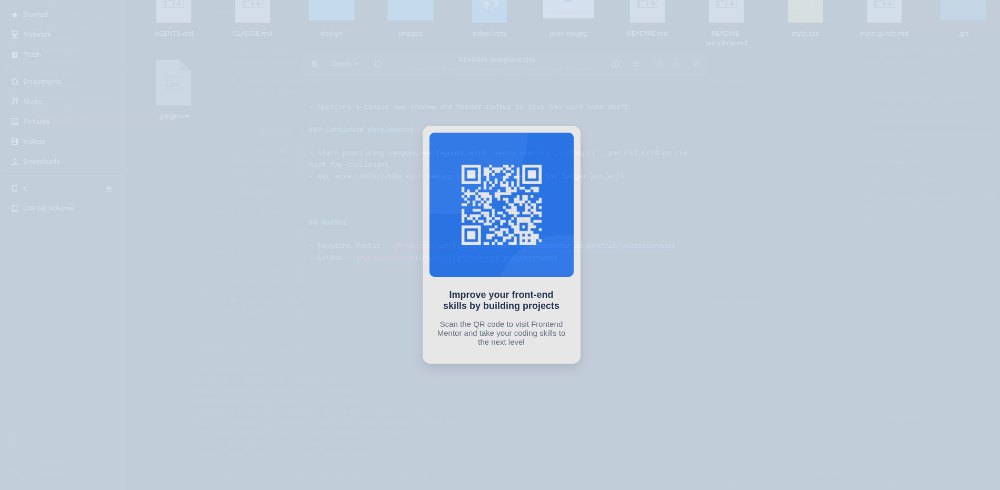

# Frontend Mentor - QR code component solution

This is a solution to the [QR code component challenge on Frontend Mentor](https://www.frontendmentor.io/challenges/qr-code-component-iux_sIO_H). Frontend Mentor challenges help you improve your coding skills by building realistic projects.

## Table of contents

- [Overview](#overview)
  - [The challenge](#the-challenge)
  - [Screenshot](#screenshot)
  - [Links](#links)
- [My process](#my-process)
  - [Built with](#built-with)
  - [What I learned](#what-i-learned)
  - [Continued development](#continued-development)
- [Author](#author)

## Overview

### The challenge

Users should be able to view the optimal layout for the component depending on their device's screen size.

This is a static card component — it doesn't need to adapt across breakpoints, which made it a great first project to practice the fundamentals of semantic HTML and CSS before moving on to fully responsive layouts.

### Screenshot



### Links

- Solution URL: [Frontend Mentor solution URL](https://your-solution-url.com)
- Live Site URL: [Live site URL](https://your-live-site-url.com)

## My process

### Built with

- Semantic HTML5 markup
- CSS custom properties
- Flexbox
- Mobile-first workflow

### What I learned

This challenge was a good starting point for practicing the basics:

- Structuring a card component with semantic HTML (`main`, `figure`, `h1`, `p`)
- Using CSS custom properties for colors and fonts to keep the stylesheet organized
- Centering a card both horizontally and vertically on the page using Flexbox

```css
body {
  display: flex;
  justify-content: center;
  align-items: center;
  min-height: 100vh;
}
```

- Applying a simple box-shadow and border-radius to give the card some depth

### Continued development

- Start practicing responsive layouts with `media queries`, `clamp()`, and CSS Grid on the next few challenges
- Get more comfortable with naming conventions like BEM for larger projects


## Author

- Frontend Mentor - [@shahinjsx](https://www.frontendmentor.io/profile/shahinjsx)
- GitHub - [@shahinjsx](https://github.com/shahinjsx)
